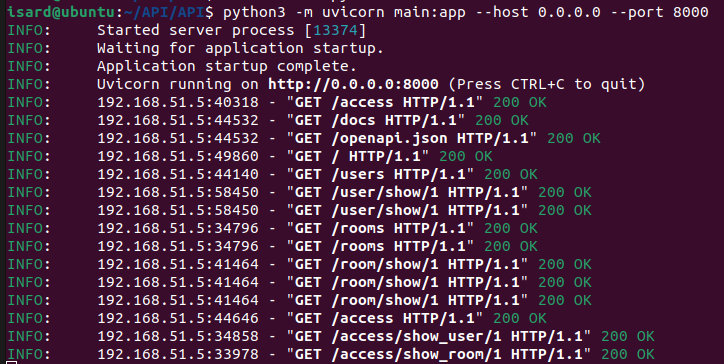

# DDBB_Projecte_Sprint02

> [!IMPORTANT]  
>## Requisits  
>**-Python 3.11.2**  
>**-FastAPI**  
>**-Uvicorn**  
>**-Pydantic**   
>**-Servidor MariaDB**

## Infraestructura Base de dades
La Base de Dades triada és MariaDB. MariaDB és una base de dades relacional de codi obert i maneja les dades de manera estructurada amb SQL.

## Rols
 - Usuari Administrador: Té tots els permisos, crear, eliminar, inserir, etc.
 - Usuari Lector: Només pot fer selects, és a dir només té la capacitat de llegir.
 - Usuari Desenvolupador: Té permisos intermedis, pot actualitzar dades, inserir noves i eliminar dades, però no pot ni crear ni eliminar taules.

## Permisos
 - SELECT: Permet llegir o consultar dades de taula.
 - INSERT: Permet afegir noves dades a una taula.
 - UPDATE: Permet modificar dades existents en una taula.
 - DELET: Permet eliminar dades d'una taula.
 - CREATE: Permet crear noves taules o altres objectes de la base de dades.
 - DROP: Permet eliminar taules o objectes de la base de dades.

## FASTAPI
He triat FASTAPI perque te un alt rendiment, es facil d'utilitzar i a l'hora de fer proves, disposa d'una documentacio interactiva de l'API amb Swagger

## Logs de les proves a ISARD

  